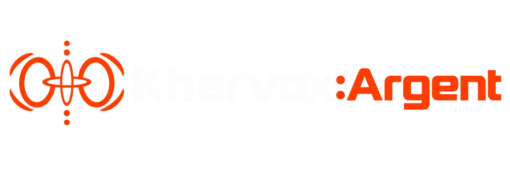
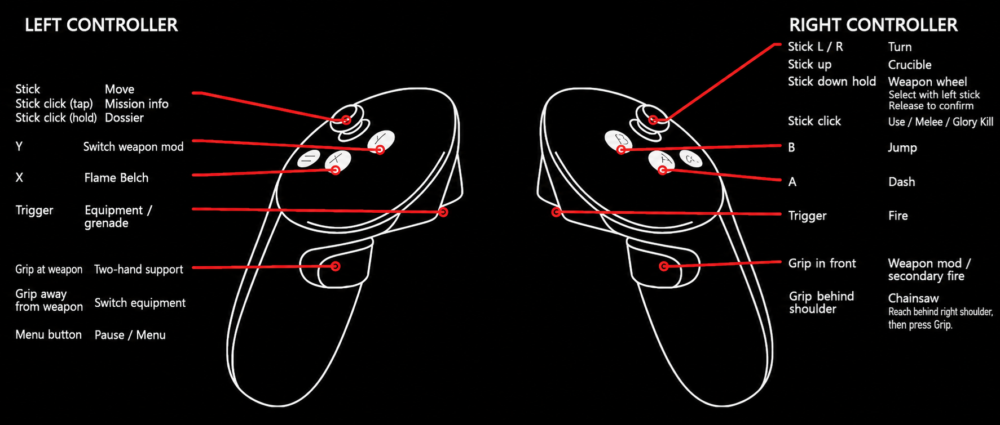

# Installation

1. Download the KHARVOX: ARGENT release ZIP.
2. Extract the complete archive into a new, writable folder of your choice. Do not run the launcher from inside the ZIP file, and do not copy ARGENT into the DOOM Eternal installation folder.
3. Make sure DOOM Eternal, your headset software and your OpenXR runtime are installed and ready. Steam and Microsoft Store installations are supported.
4. Run **ArgentLauncher.exe** from the extracted ARGENT folder.
5. Select **DOOMEternalx64vk.exe**, configure your VR options and press **PLAY**.

Keep all extracted ARGENT files together in the same folder. Start DOOM Eternal through **ArgentLauncher.exe** whenever you want to play in VR.

## Controller Binding



## Instructions

### Getting started

Connect your headset and controllers and start your OpenXR runtime. Select the DOOM Eternal executable, then press PLAY. Steam and Microsoft Store installations are supported.

Keep the game window focused for input. The native VR intro runs before the game. After its first start, Disable VR Intro appears under Rendering.

### Limitations

KHARVOX: ARGENT is a private project developed with limited resources. Compatibility and performance can vary between hardware configurations.

AMD graphics cards currently have known rendering issues. Compatibility may improve with future updates. Some effects, particularly water, can also produce visual artifacts in VR.

The mod has been tested with VDXR, SteamVR�s OpenXR runtime and Meta�s OpenXR runtime. Other runtimes have not been validated and are unsupported.

### Reccomended Headsets and Runtimes:

Quest: VDXR or MetaXR

Index: SteamVR

Please do not use SteamVR with Meta headsets. It�s known to cause issues!

### Example Configuration

Ryzen 9 5900X, 32GB DDR4, 4080S

70% Renderscale, FSR on, DLSS off, HighDetails

### Rendering

The game world is rendered in stereoscopic VR. Supported menus and tutorials automatically appear on a virtual screen.

Enable 3D Cinematics for stereoscopic presentation of supported cinematic sequences. Restart the game after changing rendering options.

### RenderScale and FSR Upscaling

100% is the native reference pixel count. Lower values reduce rendering work.

Enable FSR Upscaling to upscale reduced eye images and sharpen the result. FSR is disabled at 100% or higher. Start at 100%, then reduce gradually if needed.

The SteamVR path uses 100% and does not apply the launcher�s FSR resolution reduction. Adjust resolution through SteamVR instead.

### DLSS and anti-aliasing

Select DLSS in the game�s graphics settings if your graphics card supports it. Stereo DLSS uses separate histories for each eye but remains experimental.

DOOM Eternal normally applies temporal anti-aliasing, which can make the image look blurry in VR. ARGENT blocks native TAA in stereo rendering.

Disable FSR Upscaling in the launcher when using DLSS. FSR forces the game�s anti-aliasing off, so choose either FSR or DLSS. Compare image clarity, stability and performance in your headset.

### Desktop Mirror

Enable Desktop Mirror (Right Eye) under Rendering to display the right-eye view on your monitor. This is useful for spectators, screenshots and recording. It is disabled by default.

The mirror preserves the eye image�s aspect ratio. Black bars may appear because a VR eye image does not usually match a 16:9 desktop window.

### Mirror resolution

Choose the desktop output resolution from the dropdown:

- 720p: 1280 � 720
- 1080p: 1920 � 1080
- 2K / 1440p: 2560 � 1440
- 4K: 3840 � 2160

The default selection is 1080p. When Desktop Mirror is disabled, the desktop window uses 720p.

Mirror resolution controls the desktop output size, not the headset�s rendering resolution. Higher output resolutions may increase GPU overhead and will not add detail beyond the rendered eye image. Restart the game after changing these settings.

### Movement and controls

Index controller can access the Pause Menu with Touchpad click.

See Controller Binding for the full mapping.

Under Movement, choose smooth or snap turning, adjust turning speed or snap angle, and select head-directed or off-hand-directed movement.

Enable Left Handed Mode to reveal the layout selector:

- Button Swap: Moves weapon trigger/grip and Use/melee stick-click to the left controller. Equipment trigger/grip and Mission Info/Dossier stick-click move to the right. Face buttons and stick directions stay on their original sides.
- Button and Stick Swap: Also swaps the face-button pairs and stick directions. Move and select weapons with the right stick; turn, select Crucible and open the weapon wheel with the left stick.

The physical Menu button remains Pause.

### Two-hand support and physical melee

Enable Virtual Gunstock for two-hand support. Hold the off-hand grip near the weapon�s support point to grab it. Release the grip to let go. A grip press away from the weapon cycles equipment.

Physical Glory Kill / melee uses controller speed, the Punch speed threshold and the selected punch hand. A valid target and the game�s normal activation conditions are still required.

### PSVR2 Toolkit

PSVR2 Adaptive Triggers is experimental and requires PlayStation VR2 hardware, a working PSVR2 SteamVR setup and PSVR2 Toolkit installed separately. PSVR2Toolkit version 1.0 or higher is required.

It provides weapon-specific adaptive-trigger resistance on the weapon hand. Normal controller rumble works independently.

Missing or inactive Toolkit software does not block game startup, but adaptive-trigger effects will be unavailable.

### bHaptics

Use compatible bHaptics gear and bHaptics Player for Windows. Pair and test your devices in the Player before starting the game, then enable bHaptics under VR Options.

Missing hardware, an unavailable Player or a local bridge error does not block game startup, but suit feedback will be unavailable. Normal controller rumble works independently.

### Logging and troubleshooting

Extended Logging is disabled by default. Enable it under Rendering before pressing PLAY when investigating a problem.

Additional logging can affect performance. Disable it again when you have finished collecting logs.

### About

KHARVOX:ARGENT is an independent community project and is not affiliated with, endorsed by, or sponsored by the publisher or developers of supported games.

All trademarks and product names are property of their respective owners. A legally acquired installation of each supported game is required!

## Building from source

This repository contains the ARGENT source code. The instructions below describe the Windows build and its required dependencies.

### Requirements

- Windows x64.
- Visual Studio with the **Desktop development with C++** workload, MSVC x64 tools, MASM and a Windows SDK. The current release build uses Visual Studio 2026.
- CMake with support for your installed Visual Studio generator, Git and PowerShell.
- The complete project assets and dependencies under `third-party`, including the OpenXR loader, Vulkan headers, MinHook, SPIRV-Cross, cgltf, pocketmod, bHaptics and PSVR2 Toolkit runtime components.
- An x64 Release installation of glslang and SPIRV-Tools compatible with the MSVC toolchain. Its install directory must contain `include/glslang/Include/glslang_c_interface.h`, `bin/glslang.exe` and these libraries under `lib`: `glslang.lib`, `glslang-default-resource-limits.lib`, `SPIRV-Tools-opt.lib` and `SPIRV-Tools.lib`.

The bHaptics runtime DLL is not included in this repository. Obtain `bhaptics_library.dll` from the bHaptics SDK and place it in `third-party/bhaptics/` before building the runtime package.

### Configure and compile

Clone the repository and initialize its submodules:

```powershell
git clone --recurse-submodules https://github.com/CactusVRStudios/KHARVOX-ARGENT.git
cd KHARVOX-ARGENT
git submodule update --init --recursive
```

Run the following from the project directory in a Visual Studio Developer PowerShell. Replace the example glslang path with your own installation path. If using a different Visual Studio version, select its matching CMake generator.

```powershell
cmake -S . -B build-clean -G "Visual Studio 18 2026" -A x64 `
  -DARGENT_CLEAN_RELEASE=ON `
  -DARGENT_BUILD_SFS_TOOLS=ON `
  -DARGENT_GLSLANG_ROOT="C:/Dependencies/glslang"

cmake --build build-clean --config Release --target `
  ArgentLayer ArgentLauncher ArgentRuntimeProbe `
  KharvoxBhapticsBridge KharvoxPsvr2Bridge --parallel
```

The binaries are written to `build-clean/Release`. Keep the required runtime DLLs, shader binaries and assets with the launcher; the EXE alone is not a complete installation.

### Create a playable package

After building, use the release packaging script. Choose an unused release number and set `-CrtDirectory` to the x64 Microsoft Visual C++ redistributable directory installed with your Visual Studio toolchain:

```powershell
.\tools\package_release.ps1 -ReleaseName ARGENT-Alpha-Test-r999 `
  -CrtDirectory "C:/Path/To/VC/Redist/MSVC/<version>/x64/Microsoft.VC145.CRT"
```

The script creates a runtime folder and ZIP under `releases`, verifies the bundled integrations and preserves calibration defaults. It refuses to overwrite an existing release. Playable packages contain runtime files and assets only; source documentation, logs and debug symbols stay outside the package.

### Tests

To build and run the test suite:

```powershell
cmake --build build-clean --config Release --parallel
ctest --test-dir build-clean -C Release --output-on-failure
```

Some tests require a Vulkan-capable GPU, an OpenXR runtime or developer capture fixtures that may not be included in the source distribution. Automated tests do not replace gameplay and headset testing.
